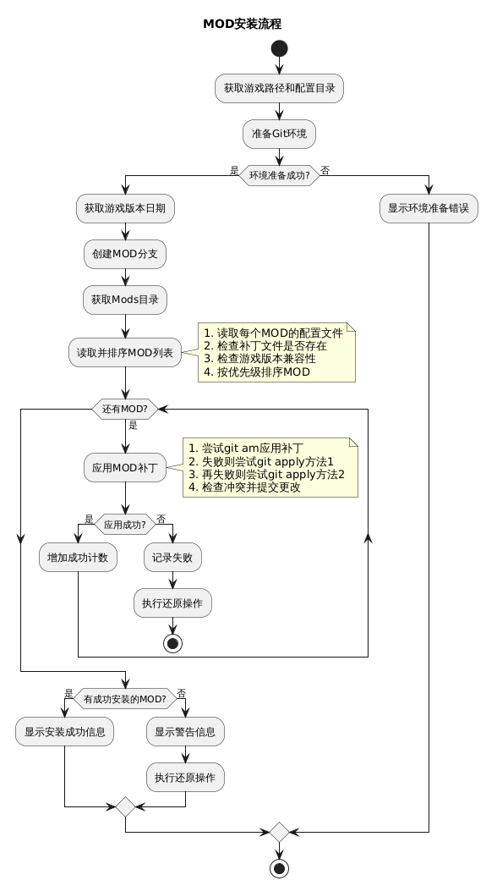

# 苏丹的游戏 MOD 管理器（GIT版）

苏丹的游戏 MOD 管理器是一个用于游戏MOD管理的项目，它使用Git来管理和更新MOD。

Git.exe 下载地址（程序依赖Git运行，如果没安装Git请先安装Git）： https://github.com/git-for-windows/git/releases/download/v2.47.0.windows.2/Git-2.47.0.2-64-bit.exe

如果下载不了或速度较慢，尝试使用阿里云镜像 https://registry.npmmirror.com/-/binary/git-for-windows/v2.49.0.windows.1/Git-2.49.0-64-bit.exe

访问地址：  https://liwenhao0427.github.io/sultans-game-mod-git-manager/

相关项目： 苏丹的游戏剧情阅读器： https://liwenhao0427.github.io/sudans-game-reader/


## 快速使用
0. 环境：确保您的游戏在使用该软件前处于未安装任何MOD的初始状态，如果电脑中没有安装过Git，需要先下载Git。
1. 进入网站 https://liwenhao0427.github.io/sultans-game-mod-git-manager/
2. 勾选您希望使用的mod，点击左上角的 `导出选中` 按钮，下载 mod 整合包。
3. 解压到任意目录，运行根目录下的 苏丹的游戏mod管理器.exe 
4. 完成了！请享受游戏吧！


## 额外说明
1. Mod 会存放在游戏根目录的 Mods 目录下，您可以随时移除不想要的 mod，之后重新运行 苏丹的游戏mod管理器.exe 即可完成更新
2. 每次游戏版本更新后，重新运行 苏丹的游戏mod管理器.exe 即可完成更新，程序会自动创建一个干净的游戏更新提交记录到主分支
3. 如果想要应用本地的分支，可以将Mod放入同级目录下的 Mods 目录中，运行 苏丹的游戏mod管理器.exe 即可加载Mod纳入管理，并立刻安装 Mod

## 功能特性
- 支持多种MOD安装模式，包括完全替换、文本替换、标记替换等
- 自动备份原始游戏文件，可随时还原
- 支持MOD冲突检测，避免不兼容MOD同时安装
- 提供MOD筛选、搜索和排序功能
- 支持查看MOD文件详情和说明文档

## Mod 配置文件结构
`modConfig.json`
```json
{
  "name": "string",
  "author": "string",
  "version": "string",
  "gameVersion": "string",
  "updateDate": "YYYY.MM.DD",
  "remark": "string",
  "tag": ["string"],
  "source": {
    "name": "string",
    "url": "string"
  }
}
```

## 字段说明

### 基本信息字段

| 字段名        | 类型   | 是否必填 | 描述                       | 示例值              |
|---------------|--------|---------|--------------------------|---------------------|
| `name`        | string | 否       | Mod 的名称标识                | "困难模式骰子成功率下降" |
| `author`      | string | 否       | Mod 的作者名称                | "萧敷艾荣"          |
| `version`     | string | 否       | Mod 版本号（推荐使用语义化版本格式）     | "1.0.0"            |
| `gameVersion` | string | 否       | 兼容的游戏版本号，后续版本通常也支持，但不做保证 | "17954583"         |
| `updateTo`  | string | 否       | 最后兼容版本，仅测试在新版本中不支持（格式：YYYY.MM.DD）    | "2025.04.08"       |
| `updateDate`  | string | 否       | 最后更新日期（格式：YYYY.MM.DD）    | "2025.04.08"       |
| `remark`      | string | 否       | Mod 的备注信息                | "修复了一些bug"     |
| `tag`         | array  | 否       | Mod 的标签，用于分类和筛选        | ["修复", "困难模式"] |


## MOD安装流程

``` markdown
@startuml MOD安装流程图
skinparam backgroundColor white
skinparam handwritten false
skinparam defaultFontName Microsoft YaHei
skinparam defaultFontSize 14
skinparam arrowColor #333333
skinparam activityBorderColor #666666
skinparam activityBackgroundColor #EEEEEE

start
:启动MOD安装器;

:检查游戏路径;
if (游戏路径存在?) then (是)
else (否)
  :提示用户输入游戏路径;
endif

:检查Git环境;
if (Git已安装?) then (是)
else (否)
  :提示下载安装Git;
  if (用户同意安装?) then (是)
    :下载并安装Git;
  else (否)
    stop
  endif
endif

:检查旧版本备份;
if (存在旧版本备份?) then (是)
  :还原旧版本备份文件;
endif

:初始化Git仓库;
:创建游戏版本标签;

:检查MOD配置;
:处理MOD补丁文件;

:创建MOD分支;
:切换到主分支;

:按优先级排序MOD;

while (还有MOD未处理?) is (是)
  :获取下一个MOD;
  
  if (MOD版本兼容?) then (是)
    :尝试应用补丁;
    if (补丁应用成功?) then (是)
      :提交更改;
    else (否)
      :分析冲突;
      :回滚更改;
      :停止安装;
      stop
    endif
  else (否)
    :跳过不兼容的MOD;
  endif
endwhile (否)

:安装完成;
stop
@enduml
```