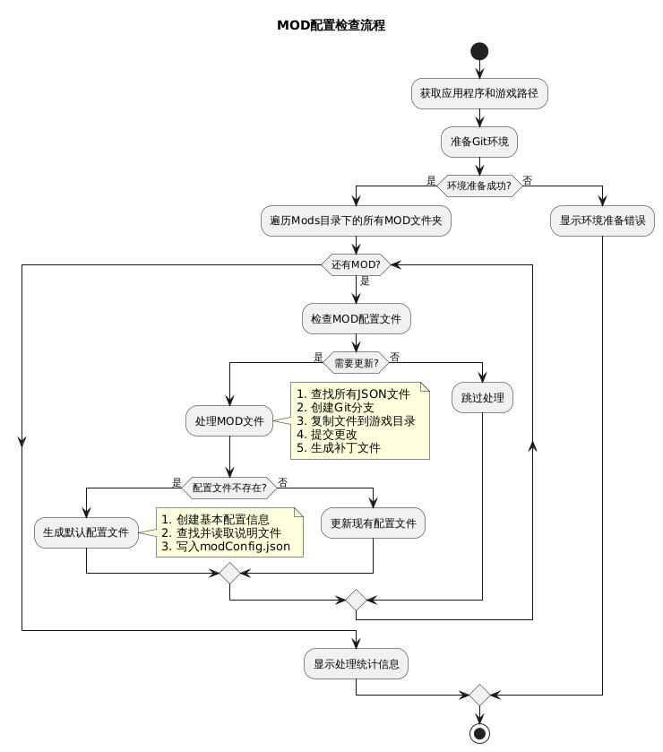

# 苏丹的游戏 MOD 管理器（GIT版）

苏丹的游戏 MOD 管理器是一个用于游戏MOD管理的项目，它使用Git来管理和更新MOD。

Git.exe 下载地址（程序依赖Git运行，如果没安装Git请先安装Git）： https://github.com/git-for-windows/git/releases/download/v2.47.0.windows.2/Git-2.47.0.2-64-bit.exe

如果下载不了或速度较慢，尝试使用阿里云镜像 https://registry.npmmirror.com/-/binary/git-for-windows/v2.49.0.windows.1/Git-2.49.0-64-bit.exe

访问地址：  https://liwenhao0427.github.io/sultans-game-mod-git-manager/

相关项目： 苏丹的游戏剧情阅读器： https://liwenhao0427.github.io/sudans-game-reader/


## 快速使用
0. 环境：确保您的游戏在使用该软件前处于未安装任何MOD的初始状态，如果电脑中没有安装过Git，需要先下载Git。
1. 进入网站 https://liwenhao0427.github.io/sultans-game-mod-git-manager/
2. 勾选您希望使用的mod，点击左上角的 `导出选中` 按钮，下载 mod 整合包。
3. 解压到任意目录，运行根目录下的 苏丹的游戏mod管理器.exe 
4. 完成了！请享受游戏吧！


## 额外说明
1. Mod 会存放在游戏根目录的 Mods 目录下，您可以随时移除不想要的 mod，之后重新运行 苏丹的游戏mod管理器.exe 即可完成更新
2. 每次游戏版本更新后，重新运行 苏丹的游戏mod管理器.exe 即可完成更新，程序会自动创建一个干净的游戏更新提交记录到主分支
3. 如果想要应用本地的分支，可以将Mod放入同级目录下的 Mods 目录中，运行 苏丹的游戏mod管理器.exe 即可加载Mod纳入管理，并立刻安装 Mod

## 功能特性
- 支持多种MOD安装模式，包括完全替换、文本替换、标记替换等
- 自动备份原始游戏文件，可随时还原
- 支持MOD冲突检测，避免不兼容MOD同时安装
- 提供MOD筛选、搜索和排序功能
- 支持查看MOD文件详情和说明文档

## Mod 配置文件结构
`modConfig.json`
```json
{
  "name": "string",
  "author": "string",
  "version": "string",
  "gameVersion": "string",
  "updateDate": "YYYY.MM.DD",
  "remark": "string",
  "tag": ["string"],
  "source": {
    "name": "string",
    "url": "string"
  }
}
```

## 字段说明

### 基本信息字段

| 字段名        | 类型   | 是否必填 | 描述                       | 示例值              |
|---------------|--------|---------|--------------------------|---------------------|
| `name`        | string | 否       | Mod 的名称标识                | "困难模式骰子成功率下降" |
| `author`      | string | 否       | Mod 的作者名称                | "萧敷艾荣"          |
| `version`     | string | 否       | Mod 版本号（推荐使用语义化版本格式）     | "1.0.0"            |
| `gameVersion` | string | 否       | 兼容的游戏版本号，后续版本通常也支持，但不做保证 | "17954583"         |
| `updateTo`  | string | 否       | 最后兼容版本，仅测试在新版本中不支持（格式：YYYY.MM.DD）    | "2025.04.08"       |
| `updateDate`  | string | 否       | 最后更新日期（格式：YYYY.MM.DD）    | "2025.04.08"       |
| `remark`      | string | 否       | Mod 的备注信息                | "修复了一些bug"     |
| `tag`         | array  | 否       | Mod 的标签，用于分类和筛选        | ["修复", "困难模式"] |


## MOD安装流程

``` markdown
@startuml
title MOD安装流程

start
:获取游戏路径和配置目录;
:准备Git环境;

if (环境准备成功?) then (是)
  :获取游戏版本日期;
  :创建MOD分支;
  :获取Mods目录;
  
  :读取并排序MOD列表;
  note right
    1. 读取每个MOD的配置文件
    2. 检查补丁文件是否存在
    3. 检查游戏版本兼容性
    4. 按优先级排序MOD
  end note
  
  while (还有MOD?) is (是)
    :应用MOD补丁;
    note right
      1. 尝试git am应用补丁
      2. 失败则尝试git apply方法1
      3. 再失败则尝试git apply方法2
      4. 检查冲突并提交更改
    end note
    
    if (应用成功?) then (是)
      :增加成功计数;
    else (否)
      :记录失败;
      :执行还原操作;
      stop
    endif
  endwhile
  
  if (有成功安装的MOD?) then (是)
    :显示安装成功信息;
  else (否)
    :显示警告信息;
    :执行还原操作;
  endif
else (否)
  :显示环境准备错误;
endif

stop

@enduml
```

## MOD检查载入流程
MOD检查工具的工作流程如下图所示：



``` markdown
@startuml
title MOD配置检查流程

start
:获取应用程序和游戏路径;
:准备Git环境;

if (环境准备成功?) then (是)
  :遍历Mods目录下的所有MOD文件夹;
  
  while (还有MOD?) is (是)
    :检查MOD配置文件;
    
    if (需要更新?) then (是)
      :处理MOD文件;
      note right
        1. 查找所有JSON文件
        2. 创建Git分支
        3. 复制文件到游戏目录
        4. 提交更改
        5. 生成补丁文件
      end note
      
      if (配置文件不存在?) then (是)
        :生成默认配置文件;
        note right
          1. 创建基本配置信息
          2. 查找并读取说明文件
          3. 写入modConfig.json
        end note
      else (否)
        :更新现有配置文件;
      endif
    else (否)
      :跳过处理;
    endif
  endwhile
  
  :显示处理统计信息;
else (否)
  :显示环境准备错误;
endif

stop

@enduml
```
