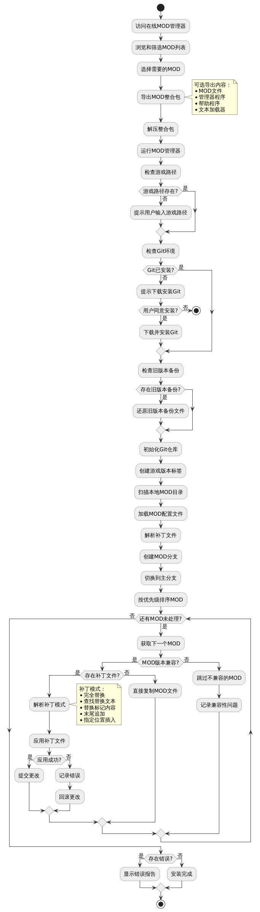

# 苏丹的游戏 MOD 管理器（GIT版）

苏丹的游戏 MOD 管理器是一个用于游戏MOD管理的项目，它使用Git来管理和更新MOD。您可以通过在线管理器轻松选择和安装MOD。

在线管理器访问地址：https://liwenhao0427.github.io/sultans-game-mod-git-manager/

Git.exe 下载地址（程序依赖Git运行，如果没有安装Git请先安装）：
- GitHub下载: https://github.com/git-for-windows/git/releases/download/v2.47.0.windows.2/Git-2.47.0.2-64-bit.exe
- 阿里云镜像: https://registry.npmmirror.com/-/binary/git-for-windows/v2.49.0.windows.1/Git-2.49.0-64-bit.exe

相关项目：苏丹的游戏剧情阅读器：https://liwenhao0427.github.io/sudans-game-reader/

## 快速使用
1. 环境准备：
   - 确保游戏处于未安装任何MOD的初始状态
   - 如果没有安装Git，请先下载并安装Git

2. MOD选择与下载：
   - 访问在线管理器：https://liwenhao0427.github.io/sultans-game-mod-git-manager/
   - 浏览MOD列表，可通过搜索、筛选、排序等功能查找MOD
   - 查看MOD详情、补丁内容和说明文档
   - 勾选需要的MOD
   - 点击左上角的"导出选中"按钮，选择导出内容并下载整合包

3. MOD安装：
   - 解压下载的整合包到任意目录
   - 运行解压目录中的"苏丹的游戏mod管理器.exe"
   - 程序会自动完成安装

## 功能特性
- 在线MOD管理：支持MOD在线浏览、搜索、筛选和导出
- 补丁预览：支持在安装前查看MOD的具体修改内容
- 版本检查：自动检查并提示MOD与游戏版本的兼容性
- 多种安装模式：支持完全替换、文本替换、标记替换、追加和插入等多种安装方式
- 自动备份：自动备份原始游戏文件，可随时还原
- 冲突检测：自动检测并提示MOD之间的冲突
- Git版本控制：使用Git管理MOD版本，支持回滚和更新

## 额外说明
1. MOD存储位置：所有MOD文件会存放在工具目录的Mods目录下
2. MOD管理：
   - 可以随时在Mods目录中移除不需要的MOD
   - 移除后重新运行管理器即可更新安装
3. 游戏更新处理：
   - 游戏版本更新后，重新运行管理器即可
   - 程序会自动处理更新并创建新的版本记录
4. 本地MOD支持：
   - 可以将自己的MOD放入程序同级目录的Mods文件夹
   - 运行管理器后会自动识别并安装本地MOD

## Mod 配置文件结构
`modConfig.json`
```json
{
  "name": "string",
  "author": "string",
  "version": "string",
  "gameVersion": "string",
  "updateDate": "YYYY.MM.DD",
  "updateTo": "YYYY.MM.DD",
  "remark": "string",
  "tag": ["string"],
  "source": {
    "name": "string",
    "url": "string"
  }
}
```

## 字段说明

### 基本信息字段

| 字段名        | 类型   | 是否必填 | 描述                       | 示例值              |
|---------------|--------|---------|--------------------------|---------------------|
| `name`        | string | 否       | Mod 的名称标识                | "困难模式骰子成功率下降" |
| `author`      | string | 否       | Mod 的作者名称                | "萧敷艾荣"          |
| `version`     | string | 否       | Mod 版本号（推荐使用语义化版本格式）     | "1.0.0"            |
| `gameVersion` | string | 否       | 兼容的游戏版本号，后续版本通常也支持，但不做保证 | "17954583"         |
| `updateTo`  | string | 否       | 最后兼容版本，仅测试在新版本中不支持（格式：YYYY.MM.DD）    | "2025.04.08"       |
| `updateDate`  | string | 否       | 最后更新日期（格式：YYYY.MM.DD）    | "2025.04.08"       |
| `remark`      | string | 否       | Mod 的备注信息                | "修复了一些bug"     |
| `tag`         | array  | 否       | Mod 的标签，用于分类和筛选        | ["修复", "困难模式"] |


## MOD安装流程

``` markdown
@startuml MOD安装流程图
skinparam backgroundColor white
skinparam handwritten false
skinparam defaultFontName Microsoft YaHei
skinparam defaultFontSize 14
skinparam arrowColor #333333
skinparam activityBorderColor #666666
skinparam activityBackgroundColor #EEEEEE

start
:访问在线MOD管理器;

:浏览和筛选MOD列表;
:选择需要的MOD;

:导出MOD整合包;
note right
  可选导出内容：
  * MOD文件
  * 管理器程序
  * 帮助程序
  * 文本加载器
end note

:解压整合包;
:运行MOD管理器;

:检查游戏路径;
if (游戏路径存在?) then (是)
else (否)
  :提示用户输入游戏路径;
endif

:检查Git环境;
if (Git已安装?) then (是)
else (否)
  :提示下载安装Git;
  if (用户同意安装?) then (是)
    :下载并安装Git;
  else (否)
    stop
  endif
endif

:检查旧版本备份;
if (存在旧版本备份?) then (是)
  :还原旧版本备份文件;
endif

:初始化Git仓库;
:创建游戏版本标签;

:扫描本地MOD目录;
:加载MOD配置文件;
:解析补丁文件;

:创建MOD分支;
:切换到主分支;

:按优先级排序MOD;

while (还有MOD未处理?) is (是)
  :获取下一个MOD;
  
  if (MOD版本兼容?) then (是)
    if (存在补丁文件?) then (是)
      :解析补丁模式;
      note right
        补丁模式：
        * 完全替换
        * 查找替换文本
        * 替换标记内容
        * 末尾追加
        * 指定位置插入
      end note
      :应用补丁文件;
      if (应用成功?) then (是)
        :提交更改;
      else (否)
        :记录错误;
        :回滚更改;
      endif
    else (否)
      :直接复制MOD文件;
    endif
  else (否)
    :跳过不兼容的MOD;
    :记录兼容性问题;
  endif
endwhile (否)

if (存在错误?) then (是)
  :显示错误报告;
else (否)
  :安装完成;
endif

stop
@enduml
```